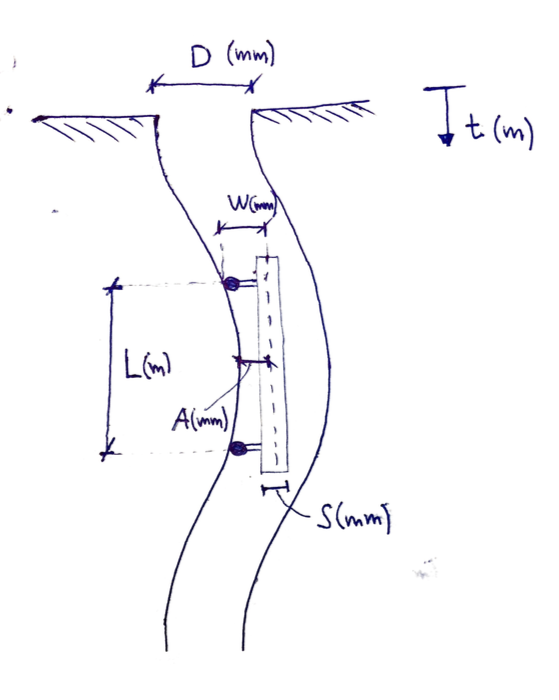

## Inclino
Inclinometer collision detection script in python

## Usage
In a terminal, having installed numpy and scipy, run

```
python inclino.py example.csv
```

where `example.csv` is a csv file containing inclination measurement series as columns, just as can be seen in `example.csv`. The script will ask for a bunch of parameters which are defined in the figure below:


