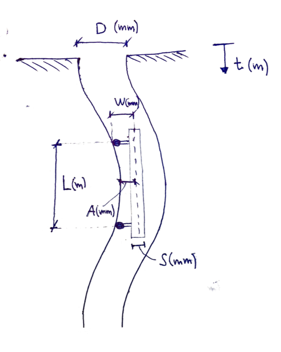

# Usage (Windows)

Download [inclino.exe](https://www.dl.dropboxusercontent.com/s/u19pco0bwyio1qn/inclino.exe) and save it for example on your desktop. 

Run `inclino.exe`. It might take 20-30 seconds before the script runs in the command line. 

It will ask for a csv-file which has the following structure:
 - First column: The *depth* of inclination measurements
 - Second column: The *inclination* measurements

An example of such a file can be viewed in `example.csv`.

The script will ask for a bunch of parameters which are defined in the figure below. It will then go on to compute A(t) which is the distance from the instrument axis to the borehole wall. The two resulting lines represent the distance for both sides. 



# Usage (Mac/Linux)
1. Clone this repo 

2. Make sure you have numpy and scipy installed:
```
pip install numpy scipy
```

3. run 
```
python inclino.py
```

# About

	Inclino v0.6
	Written by Luca Naterop
	Zürich, 2017
	Questions, suggestions and comments to luca@naterop.net
